<div align="center">



<a href="https://github.com/Ommdutta26">
  
</a>

<br/>

<p>
  <a href="https://github.com/Ommdutta26">
    
  </a>
  <a href="https://www.linkedin.com/in/omm-dutta-0170922a4">
    
  </a>
  
  
</p>

</div>


## `> whoami`

```yaml
name:       Omm Dutta
education:  B.Tech Information Technology @ IIIT Bhubaneswar
focus:      [AI/ML, Generative AI, Agentic AI, Full Stack]
currently:  Building intelligent AI-powered applications
mode:       Building -> Learning -> Shipping
status:     Open to AI / Backend / Full Stack opportunities
```

<br/>

## `> ls ./what-i-build`

<table>
<tr>
<td width="33%" valign="top">

### 🤖 Agentic AI
AI agents and multi-agent workflows with planning, tool use and memory.

</td>
<td width="33%" valign="top">

### 🧠 GenAI and RAG
LLM apps with retrieval, reranking and vector search that stay grounded.

</td>
<td width="33%" valign="top">

### 📊 Machine Learning
Fraud detection and ensemble models with explainable outputs.

</td>
</tr>
<tr>
<td valign="top">

### 🌐 Full Stack
Fast, polished web apps with React and Next.js on the front and Node on the back.

</td>
<td valign="top">

### ⚙️ Backend Systems
REST APIs, auth, caching and distributed services built to scale.

</td>
<td valign="top">

### 🚀 Production Software
Shipped, deployed and monitored software, not just demos.

</td>
</tr>
</table>

<br/>

## `> cat ./tech-stack`

<div align="center">

**Languages**


**Frontend**


**Backend and Databases**


**AI / ML / GenAI**


**Tools and Cloud**


</div>

<br/>

## `> ./run featured-projects`

<table>
<tr>
<td width="50%" valign="top">

### 🛡️ Sentinel AI
**Financial Fraud Detection Agent**

An AI-powered fraud detection system that combines ensemble ML models with explainable AI so every flagged transaction comes with a reason.


</td>
<td width="50%" valign="top">

### 🎤 InterviewFlow AI
**AI Mock Interview Platform**

Real-time video interviews, live coding assessments and AI-driven candidate evaluation in one workflow.


</td>
</tr>
<tr>
<td colspan="2" valign="top">

### 🔬 ResearchMind
**Multi-Agent AI Research System**

Multi-agent research workflows that pair hybrid retrieval (BM25 plus vector search), cross-encoder reranking and LLM reasoning to produce grounded answers.


</td>
</tr>
</table>

<br/>

## `> git stats --live`

<div align="center">


<br/>


<br/>


</div>

<br/>

## `> tail -f ./activity.log`

<div align="center">


</div>

<br/>

## `> ping --connect`

**AI Engineering · Generative AI · Agentic AI · Backend Engineering · Full Stack Development · Machine Learning**

If you are building something in this space, I would like to hear about it.

<div align="center">

<a href="https://www.linkedin.com/in/omm-dutta-0170922a4">
  
</a>


</div>
